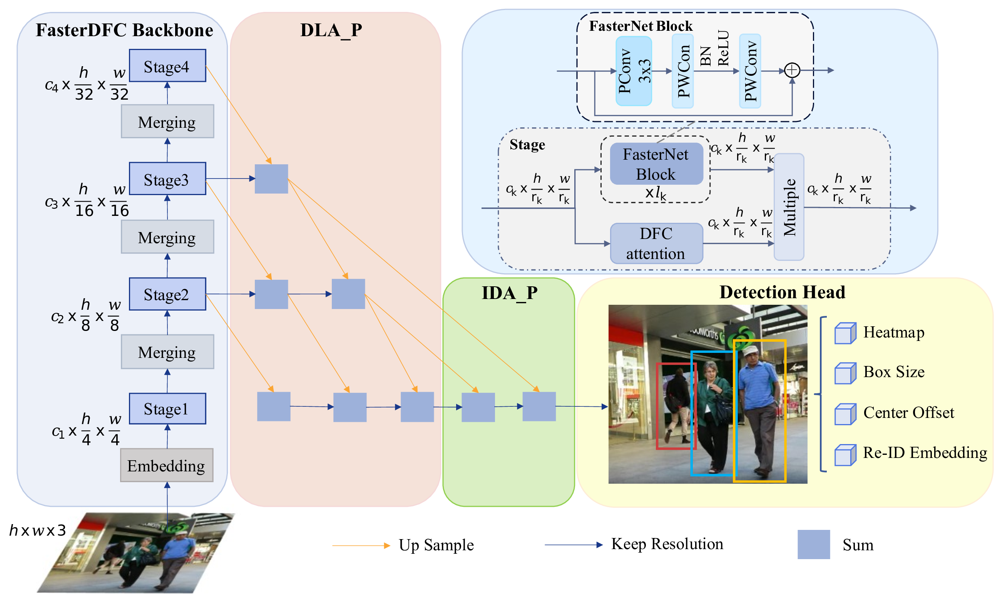

# FasterMOT

## backbone

## Experience
1.Training ablation model：
sh experiments/mix_mot17_half_dla34.sh

2.Test ablation model:
python src/track_half.py mot --load_model ../exp/mot/mix_mot17_half_dla34.pth --conf_thres 0.4 --val_mot17 True --arch fasterdfc_1242 --attention_type dfc

3.train:mot17：
sh experiments/crowdhuman_dla34.sh
sh experiments/mix_ft_ch_dla34.sh

4.train:mot20：
1）：note off jde.py:
#np.clip(xy[:, 0], 0, width, out=xy[:, 0])
#np.clip(xy[:, 2], 0, width, out=xy[:, 2])
#np.clip(xy[:, 1], 0, height, out=xy[:, 1])
#np.clip(xy[:, 3], 0, height, out=xy[:, 3])
2）：Terminal Execution：
sh experiments/crowdhuman_dla34.sh
sh experiments/mix_ft_ch_dla34.sh
sh experiments/mot20_ft_mix_dla34.sh

5.test:mot17：
python src/track.py mot --load_model ../models/fairmot_dla34.pth --conf_thres 0.4 --test_mot17 True --arch fasterdfc_1242 --attention_type dfc

6.test:ot20：
python src/track.py mot --test_mot20 True --load_model your_mot20_model.pth --conf_thres 0.3 --test_mot20 True --arch fasterdfc_1242 --attention_type dfc

